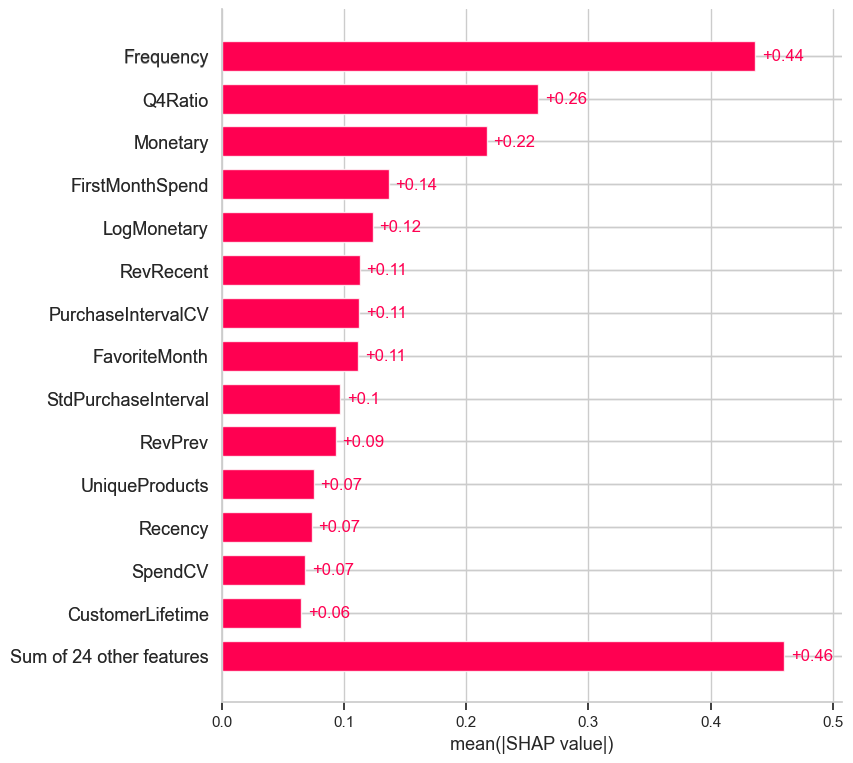
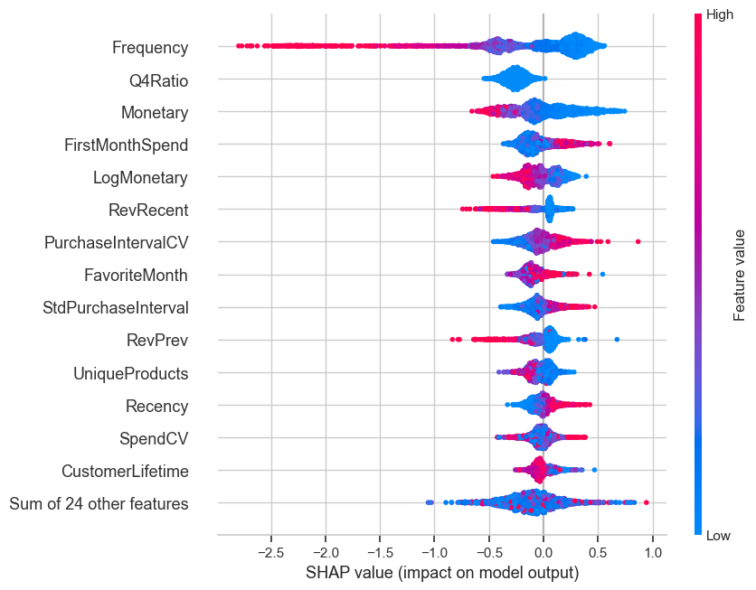
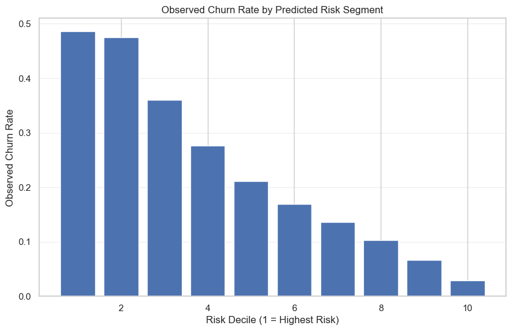

# Customer Churn Prediction

An end-to-end machine learning project that predicts customer churn using transactional retail data.

The model identifies high-risk customers and shows that **the top 30% highest-risk segment captures over 50% of all churners**, enabling highly targeted and cost-effective retention strategies.

The project demonstrates a complete data science workflow, including data cleaning, time-aware feature engineering, walk-forward validation, and interpretable machine learning models.

------------------------------------------------------------------------

## Key Results
- Top 10% highest-risk customers show ~56% churn rate vs ~1.6% in lowest-risk segment  
- Top 20% highest-risk customers capture **39.3% of all churners**  
- Top 30% highest-risk customers capture **53.9% of all churners**  

------------------------------------------------------------------------

# Project Overview

Customer churn prediction is a critical problem for many businesses
because retaining existing customers is often significantly cheaper than
acquiring new ones.

This project builds a predictive modeling pipeline that uses historical
transaction data to estimate the probability that a customer will churn
within a future time window.

The project follows a realistic data science workflow:

1.  Data cleaning and validation
2.  Exploratory data analysis to understand customer behavior
3.  Feature engineering using time-aware sliding windows
4.  Walk-forward model validation to avoid temporal leakage
5.  Model interpretation and business impact analysis

------------------------------------------------------------------------

# Dataset

The project uses the **Online Retail dataset**, which contains
transactional data from a UK-based e-commerce retailer.

The dataset includes:

-   Customer ID
-   Invoice number
-   Product description
-   Quantity purchased
-   Unit price
-   Transaction timestamp
-   Customer country

Each row represents a single product purchased in a transaction.

Dataset source: https://archive.ics.uci.edu/ml/datasets/online+retail

------------------------------------------------------------------------

# Problem Definition

The goal is to predict **customer churn**, defined as a customer who
**does not make a purchase during a future prediction window**.

To simulate a realistic prediction scenario, the dataset is structured
using **observation windows** and **prediction windows**.

Observation Window -- Used to compute behavioral features.\
Prediction Window -- Used to determine whether the customer churned.

This approach ensures the model only uses **historical information
available at prediction time**, preventing data leakage.

------------------------------------------------------------------------

# Project Pipeline

Raw Transaction Data\
↓\
Data Cleaning and Validation\
↓\
Exploratory Data Analysis\
↓\
Feature Engineering (Sliding Time Windows)\
↓\
Walk-Forward Model Training\
↓\
Model Evaluation and Interpretation\
↓\
Business Impact Analysis

------------------------------------------------------------------------

# Repository Structure

    customer-churn-prediction/

    notebooks/
    │
    ├── 01_data_cleaning.ipynb
    ├── 02_eda.ipynb
    ├── 03_feature_engineering.ipynb
    └── 04_modeling.ipynb

    src/
    Feature engineering pipeline and utility functions

    reports/figures
    Generated figures and analysis outputs

Notebook descriptions:

**01_data_cleaning** - Data audit and schema validation - Handling
missing values and duplicates - Transaction labeling and return
matching - Outlier assessment and dataset validation

**02_eda** - Business metrics and revenue analysis - Customer behavioral
patterns - RFM analysis - Cohort analysis - Statistical testing of churn
signals

**03_feature_engineering** - Sliding window generation - Customer
behavioral feature extraction - Engagement and lifecycle features -
Feature stability diagnostics

**04_modeling** - Walk-forward validation framework - Model training and
hyperparameter tuning - Threshold optimization - SHAP model
interpretation - Business impact analysis

------------------------------------------------------------------------

# Feature Engineering

Customer-level features are generated using **sliding observation windows** to capture purchasing behavior over time.

The feature set focuses on describing customer engagement, spending patterns, purchase regularity, lifecycle dynamics, and seasonal purchasing behavior.

### Key Features

| Feature | Description |
|--------|-------------|
| Frequency | Number of purchases during the observation window |
| Monetary | Total spending during the observation window |
| Recency | Days since the customer's last purchase |
| Q4Ratio | Proportion of purchases occurring in Q4 (captures seasonal buying behavior) |
| PurchaseIntervalCV | Variability in time between purchases |
| SpendCV | Variability in order value |
| CustomerLifetime | Time since the customer's first purchase |

A **complete feature definition table** is available in the Feature Engineering notebook:

`notebooks/03_feature_engineering.ipynb`

------------------------------------------------------------------------

# Modeling Approach

To avoid temporal data leakage, the project uses **walk-forward
validation**.

Instead of randomly splitting the dataset, the model is trained on past
windows and evaluated on future windows.

Models evaluated include:

-   Random Forest
-   Gradient Boosting
-   XGBoost

Model performance is evaluated using:

-   ROC-AUC
-   Precision
-   Recall
-   F1 score

Additionally, the classification threshold is optimized to balance
recall and precision for churn detection.

------------------------------------------------------------------------

# Model Insights

## Feature Importance

The following plot shows the global importance of each feature based on
the **average absolute SHAP value**.

Key drivers of churn prediction include:

-   Purchase frequency
-   Seasonal purchase patterns (Q4 ratio)
-   Customer spending behavior
-   Early engagement signals
-   Purchase interval variability

------------------------------------------------------------------------

## Feature Effects on Churn

The SHAP beeswarm plot shows how different feature values influence the
churn prediction.

Each dot represents a customer observation.\
The horizontal position indicates the impact on the prediction, while
the color indicates the feature value.

This visualization highlights how customer behavioral patterns influence
the model's predictions.

------------------------------------------------------------------------

# Business Impact

The model enables **targeted and cost-effective retention strategies** by ranking customers based on churn risk.

Key insights:

- The highest-risk segment shows a churn rate of ~56%, compared to ~1.6% in the lowest-risk group  
- The top 20% highest-risk customers capture **39.3% of all churners**  
- The top 30% highest-risk customers capture **53.9% of all churners**  

This demonstrates that churn risk is **highly concentrated in a relatively small portion of customers**.

This allows companies to:

- Focus retention efforts on a high-impact subset of customers  
- Reduce wasted marketing spend on low-risk users  
- Prioritize interventions where they are most likely to have an effect  

Example:
By targeting only the top 20–30% highest-risk customers, a company can capture a large share of future churners, making retention campaigns significantly more efficient and cost-effective.
------------------------------------------------------------------------

## Churn Risk Segmentation

Customers can be segmented into risk groups based on predicted churn
probability.

This segmentation enables companies to prioritize retention efforts
toward customers with the highest churn risk.

------------------------------------------------------------------------
## How This Would Be Used in Practice

1. Run the model periodically on active customers  
2. Rank customers by predicted churn probability  
3. Segment customers into risk deciles  
4. Target high-risk segments with retention campaigns  
   (e.g., discounts, re-engagement emails, loyalty incentives)  

------------------------------------------------------------------------

# Future Work

Several extensions could further improve the modeling framework.

Approaches such as recurrent neural networks or
transformer architectures may capture temporal dependencies that
aggregated features cannot fully represent.

Finally, the pipeline could be extended to support **production
deployment**, including automated feature generation, scheduled model
retraining, and monitoring of prediction drift over time.

------------------------------------------------------------------------

# Requirements

Main Python libraries used in this project:

-   pandas
-   numpy
-   scikit-learn
-   xgboost
-   matplotlib
-   seaborn
-   shap
-   tqdm

Install dependencies using:

    pip install -r requirements.txt

------------------------------------------------------------------------

# Author

Stefano Brusadelli

GitHub: https://github.com/stefanobrusadelli

------------------------------------------------------------------------

# License

This project is provided for educational and portfolio purposes.
