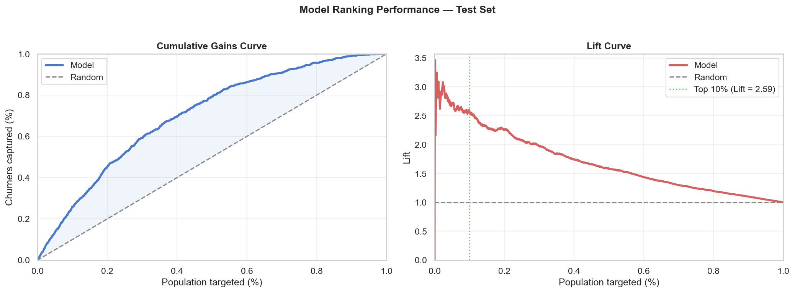
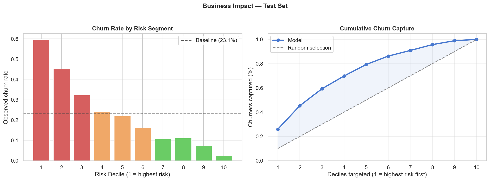

# Customer Churn Prediction

Stefano Brusadelli · [LinkedIn](https://www.linkedin.com/in/stefano-brusadelli-a4919a161)

End-to-end machine learning pipeline for predicting customer churn from transactional purchase data. Built as a portfolio project demonstrating production-oriented ML practices: temporal validation, business-metric optimization, and interpretable modeling.

---

## Results

| Metric | Value |
|---|---|
| ROC-AUC (test) | 0.763 |
| Precision@10% | 59.7% |
| Lift@10% | 2.59x |
| Churners captured in top 30% | 59.3% |


*The model consistently outperforms random selection across all 
targeting thresholds. At the top 10% cutoff (green line) the lift 
is 2.59x; meaning churners are identified at 2.59 times the rate 
of random selection.*

---

## Project Structure

```
customer-churn-prediction/
├── notebooks/
│   ├── 01_data_cleaning.ipynb        # Structural, semantic, and behavioral cleaning
│   ├── 02_eda.ipynb                  # Exploratory analysis and churn definition
│   ├── 03_feature_engineering.ipynb  # Sliding window feature construction
│   └── 04_modeling.ipynb             # Model training, tuning, and evaluation
├── src/
│   └── churn/
│       ├── config.py                 # Window configuration constants
│       ├── feature_builders.py       # Individual feature group builders
│       ├── feature_pipeline.py       # Feature extraction orchestration
│       ├── validation.py             # Data quality checks
│       └── windowing.py              # Temporal window utilities
├── data/
│   ├── raw/                          # Raw Excel data (not committed — see below)
│   └── processed/                    # Generated parquet files (not committed)
├── models/                           # Saved model artifacts (not committed)
├── reports/
│   └── figures/                      # Generated plots (committed as reference)
└── README.md
```

---

## Pipeline Overview

### 1. Data Cleaning (`01_data_cleaning.ipynb`)

The raw [UCI Online Retail II](https://archive.ics.uci.edu/dataset/502/online+retail+ii) dataset covers transactions from a UK-based online retailer (December 2009 – December 2011). Three types of cleaning are applied:

- **Structural** — missing values (22.8% missing Customer IDs dropped), duplicates, invalid records
- **Semantic** — data type standardization, column renaming
- **Behavioral** — transaction classification into five categories using stock code patterns, quantity matching, and temporal logic:
  - `Standard_Purchase`, `Linked_Return`, `Unlinked_Return`, `System_Void`, administrative types

Returns are matched to prior purchases within a 30-day window. Cancellations within 60 minutes are classified as system voids rather than genuine returns.

### 2. Exploratory Data Analysis (`02_eda.ipynb`)

Analysis focuses on UK customers (~85% of revenue). Key findings:

- **Engagement intensity is the primary churn driver** — Frequency and Monetary show the strongest separation between churned and active customers (Mann-Whitney effect size ~0.75)
- **Churn is front-loaded** — retention drops from 100% to 20–37% after the first month across all cohorts; 24.1% of customers purchase only once and churn at 77.3%
- **90-day churn threshold** — grounded in interpurchase time distribution; by 90 days the return probability is in the sparse tail of the distribution
- **Loyal segment anomaly** — the Loyal RFM segment shows 67.6% apparent churn under the static definition, confirmed as a definition artifact: these are year-round consistent buyers caught between purchase cycles by a snapshot definition

### 3. Feature Engineering (`03_feature_engineering.ipynb`)

23 behavioral features are constructed using a **sliding window framework**. Features for each customer are computed only from data available before the prediction point, preventing temporal leakage.

**Window configuration:**
- Observation window: 180 days
- Prediction window: 90 days
- Step size: 30 days
- 16 windows generated → 21,110 customer-window observations

**Feature groups:**

| Group | Features |
|---|---|
| RFM | `Recency`, `Frequency`, `Monetary`, `LogMonetary` |
| Order value | `AvgOrderValue`, `OrderValueCV` |
| Timing | `AvgPurchaseInterval`, `PurchaseIntervalCV`, `DelayRatio` |
| Engagement | `EngagementDensity`, `ValueEngagement` (derived: LogMonetary × EngagementDensity) |
| Early lifecycle | `FirstMonthPurchases`, `MonetaryFirstMonth`, `AvgOrderValueFirstMonth` |
| Trend | `RevenueTrend`, `RecentShareLog` |
| Product | `UniqueProducts`, `ProductDiversityRate`, `ReturnRate` |
| Lifecycle | `CustomerLifetime` |
| Seasonality | `Q4Ratio`, `FavoriteMonthSin`, `FavoriteMonthCos` |

`ValueEngagement` (the interaction of log-monetary value and engagement density) emerged as the strongest individual predictor, confirmed by SHAP analysis in the modeling stage.

**Known issue:** `Q4Ratio` is zero for all customers in windows outside October–December, making it a calendar artifact rather than a behavioral signal. It is flagged for removal in the next iteration.

### 4. Modeling (`04_modeling.ipynb`)

**Validation strategy:** Walk-forward cross-validation with 4 folds. Models are always trained on past windows and evaluated on future ones, replicating production deployment conditions.

**Algorithm selection:** Four tree-based models compared (XGBoost, Gradient Boosting, Random Forest, Voting Ensemble). All perform similarly (AUC 0.74–0.76). XGBoost is selected for its improving trajectory as training data grows and its tunable hyperparameter space.

**Optimization metric:** A custom `Lift@10%` scorer is used instead of ROC-AUC. Retention campaigns have finite capacity, so optimizing for ranking quality in the top decile is more operationally relevant than global ranking quality.

**Hyperparameter tuning:** `RandomizedSearchCV` with 80 iterations, optimizing Lift@10% directly using the same walk-forward splits. CV Lift@10% improved from 1.955 (baseline) to 2.124 (tuned), an 8.6% improvement.

**`scale_pos_weight = 1.5`** — empirically confirmed as optimal via sweep across values 0.8–1.5. Despite the ~33% average churn rate, a mild upweight improves top-decile precision by compensating for window-level distribution shift across the seasonal dataset.

---

## Business Impact

Customers in the test set are ranked by predicted churn probability and grouped into risk deciles. Churn rate and average spend vary monotonically across deciles, revealing an important finding: **churn risk and customer value are inversely correlated**.

| Decile | Churn Rate | Avg Spend | Cum. Churners Captured |
|---|---|---|---|
| 1 (highest risk) | 59.7% | £529 | 25.9% |
| 2 | 45.0% | £659 | 45.4% |
| 3 | 32.2% | £669 | 59.3% |
| 4 | 24.3% | £924 | 69.8% |
| 5–10 | 2.5–21.9% | £975–£7,495 | — |


*Churn rate decreases almost monotonically from 59.7% in the highest-risk 
decile to 2.5% in the lowest. Targeting the top 30% of customers 
captures 59.3% of all churners.*

The highest-risk customers spend on average £529; less than a tenth of the £7,495 average in the lowest-risk decile. This motivates a **cost-sensitive tiered intervention strategy** rather than uniform high-touch outreach:

| Tier | Deciles | Avg Spend | Suggested action |
|---|---|---|---|
| High value, high risk | 1–2, high spend | £600+ | Personal outreach |
| Low value, high risk | 1–2, low spend | <£600 | Automated offer |
| Medium risk | 3–4 | £669–£924 | Targeted email |
| No action | 5–10 | £975–£7,495 | Monitor only |

---

## Key Technical Decisions

**Why walk-forward validation instead of random CV?**
Random CV mixes past and future observations, producing artificially optimistic estimates. Walk-forward ensures models are always evaluated on data they could not have seen during training.

**Why Lift@10% as the optimization metric?**
ROC-AUC rewards global ranking quality. For a retention campaign with fixed capacity, only the top-ranked customers matter. Optimizing directly for top-decile precision produced an 8.6% improvement over AUC-optimized tuning.

**Why `scale_pos_weight = 1.5` on a near-balanced dataset?**
With ~33% average churn rate, aggressive class weighting is not needed. The mild upweight compensates for window-level churn rate variation (21%–46% across windows due to seasonality) rather than correcting class imbalance.

**Why `Precision@10%` over `Lift@10%` for cross-period comparison?**
`Lift@10%` is a ratio over the baseline churn rate. When the baseline shifts seasonally (32.9% training vs 23.1% test), lift values are not directly comparable. `Precision@10% = 59.7%` is stable regardless of baseline and is the preferred metric for comparing performance across time periods.

---

## SHAP Feature Importance

`ValueEngagement` dominates the SHAP rankings by a large margin (SHAP range ±3, dwarfing all other features). The top predictors group into four behavioral dimensions:

1. **Value engagement** — `ValueEngagement` (dominant)
2. **Frequency and regularity** — `Frequency`, `AvgPurchaseInterval`, `PurchaseIntervalCV`
3. **Monetary signals** — `Monetary`, `MonetaryFirstMonth`, `LogMonetary`, `AvgOrderValue`
4. **Customer history** — `CustomerLifetime`, `ProductDiversityRate`

`Recency` ranks lower than classical RFM theory would suggest. `ValueEngagement` and `Frequency` already capture much of the same signal, making recency partially redundant once those features are present.


*`ValueEngagement` dominates by a large margin. Each dot represents 
one customer; red indicates high feature value, blue indicates low.*

---

## Setup

### Requirements

```bash
pip install -r requirements.txt
```

### Data

Raw data is not committed due to file size. Download the [UCI Online Retail II dataset](https://archive.ics.uci.edu/dataset/502/online+retail+ii) and place it at:

```
data/raw/online_retail_II.xlsx
```

### Running the pipeline

Run notebooks in order:

```
01_data_cleaning.ipynb
02_eda.ipynb
03_feature_engineering.ipynb
04_modeling.ipynb
```

Each notebook reads from the previous notebook's output in `data/processed/`.

---

## Limitations and Next Iteration

- **`Q4Ratio` should be removed** — zero for all customers outside Q4 observation windows, making it a calendar artifact with no predictive value at test time
- **Cross-window lag features not included** — features are computed independently per window; a customer dropping from 10 purchases to 3 looks identical to one who has always purchased 3 times. Delta features capturing change from the previous window are the highest-priority addition
- **Single test period** — test metrics are based on two windows (approximately two months). A longer evaluation window spanning multiple seasons would give more reliable performance estimates
- **No production deployment pipeline** — the model is saved as a `.pkl` file but there is no serving infrastructure

---

## Dataset

UCI Online Retail II — [https://archive.ics.uci.edu/dataset/502/online+retail+ii](https://archive.ics.uci.edu/dataset/502/online+retail+ii)

Dua, D. and Graff, C. (2019). UCI Machine Learning Repository. Irvine, CA: University of California, School of Information and Computer Science.
